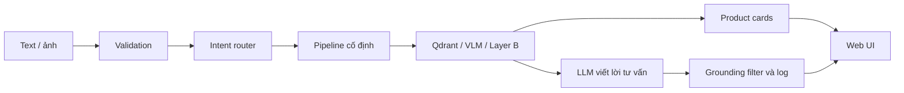

# Bắt đầu đọc hệ thống từ đây

Tài liệu này là bản đồ bàn giao chính thức cho `research_demo_v3`. Không cần đọc toàn bộ code hoặc notebook theo thứ tự tên file.

## Ba đường đọc

| Người đọc | Mục tiêu | Thứ tự |
|---|---|---|
| Hội đồng | Hiểu bài toán, kiến trúc và đóng góp | `01_SYSTEM_OVERVIEW.md` |
| Nhóm viết báo cáo | Viết đúng kiến trúc và luồng xử lý | `01` → `03` → `04` → `05` → `09` → `10` |
| Người tiếp quản kỹ thuật | Cài, chạy, debug và sửa code | Đọc tuần tự `00` → `09` |

## Mô hình tinh thần

Đây không phải một LLM nhận câu hỏi rồi tự trả lời. Hệ thống là một bộ điều phối:

LLM có thể hỗ trợ hiểu câu mơ hồ và viết lời tư vấn. Python mới là thành phần quyết định route hợp lệ. Qdrant và product card là nguồn sự thật về sản phẩm.

## Nguồn sự thật của từng phần

| Nội dung | File nguồn |
|---|---|
| Endpoint, state, orchestration, SSE | `app/api.py` |
| Model, collection, threshold | `app/config.py` |
| Intent, action, slot, route | `app/core/intent.py` |
| Text/image retrieval | `app/core/vector_store.py`, `app/core/image_search.py` |
| Outfit Layer B → Layer A | `app/core/outfit.py` |
| LLM prompt và chain | `app/core/llm.py`, `app/core/chains.py` |
| VLM | `app/core/vision.py` |
| Validation, grounding, log | `app/core/security.py` |
| Giao diện | `app/static/index.html` |

Nếu tài liệu và code mâu thuẫn, code là nguồn sự thật; sau đó phải cập nhật lại tài liệu trong cùng pull request.

## Notebook nên đọc

`notebooks/research_demo_v3_split/00_INDEX.ipynb` là bản đồ notebook. Notebook giải thích và thử nghiệm; web app dùng code trong `app/` để chạy thật.

## Quy tắc khi thay đổi hệ thống

1. Thay đổi policy router phải thêm case vào `tests/router_eval_cases.jsonl`.
2. Thay đổi input/output API phải cập nhật `07_API_FRONTEND_CONTRACT.md`.
3. Thay đổi model, vector dimension hoặc collection phải cập nhật `02_SETUP_AND_MODELS.md` và `03_DATA_AND_INDEXING.md`.
4. Không dùng `confidence` do LLM tự khai để quyết định route; dùng `certainty` và policy Python.
5. Mã, giá, thương hiệu và ảnh phải đến từ product card/retrieval, không đến từ lời LLM.

