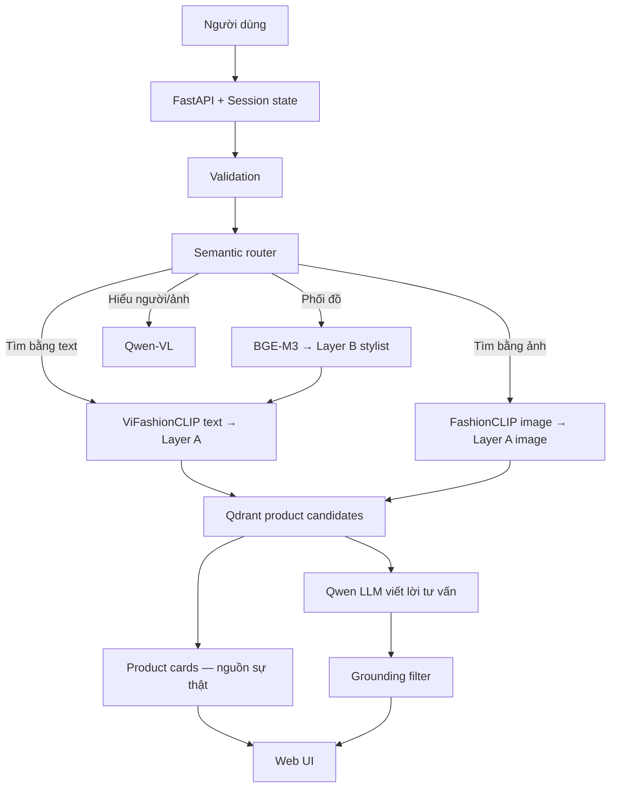

# Tổng quan hệ thống — bản dành cho Hội đồng

## Bài toán

Hệ thống hỗ trợ người dùng tìm và phối trang phục trong kho sản phẩm lớn bằng tiếng Việt và ảnh. Nó kết hợp retrieval đa phương thức, tri thức stylist, VLM và LLM nhưng giới hạn vai trò của từng model để giảm bịa đặt.

## Đầu vào và đầu ra

- Đầu vào: text, ảnh hoặc text + ảnh; kèm `session_id` và tùy chọn Developer Mode.
- Đầu ra trực quan: product card gồm ảnh, tên, giá, thương hiệu, mã sản phẩm; lời tư vấn; câu hỏi tiếp nối.
- Đầu ra kỹ thuật: intent, action, route, filter, timing, số lần gọi model và grounding report.

## Kiến trúc theo trách nhiệm

## Hai lớp tri thức

- Layer A chứa sản phẩm thật. Nó trả lời: “Trong kho có món nào phù hợp?”
- Layer B chứa quy tắc stylist. Nó trả lời: “Một set hợp lý cần những loại món nào?”

Luồng outfit tìm một rule Layer B trước, lấy các slot như áo/quần/giày, rồi quay lại Layer A lấy một sản phẩm thật cho từng slot. Vì vậy LLM không tự nghĩ ra set đồ từ trí nhớ.

## Router có bao nhiêu intent và route?

Hệ thống có một top-level router, sáu business intent và tám execution route.

| Intent | Ý nghĩa |
|---|---|
| `product_discovery` | Tìm, xem, so sánh, hỏi giá/size/tồn kho |
| `outfit_advice` | Tạo hoặc điều chỉnh outfit |
| `profile_analysis` | Phân tích dáng người/tone da bằng ảnh |
| `profile_management` | Đọc, cập nhật hoặc xóa profile |
| `social` | Chào, cảm ơn, tạm biệt |
| `out_of_scope` | Ngoài phạm vi thời trang |

Tám route là text/image product search, text/image outfit, VLM profile, profile state, social và out-of-scope. `clarify` là trạng thái điều khiển, không phải business route.

## Vì sao router không phụ thuộc hoàn toàn vào LLM?

Các câu chắc chắn đi qua luật Python nhanh. Chỉ câu mơ hồ mới gọi LLM để phân loại ngữ nghĩa. Kết quả LLM bị ép vào enum intent/action; Python `resolve_route()` mới ánh xạ sang pipeline. LLM không thể phát minh route mới.

`certainty` mô tả nguồn quyết định:

- `deterministic`: luật rõ ràng.
- `contextual`: dựa vào ảnh hoặc state.
- `llm_assisted`: LLM hỗ trợ hiểu ngôn ngữ.
- `clarification_required`: chưa đủ mục tiêu để chạy an toàn.

Đây là mức vận hành có thể kiểm chứng, không phải xác suất do model tự khai.

## Đóng góp kỹ thuật chính

1. Retrieval sản phẩm text và ảnh nằm trong không gian FashionCLIP 512 chiều.
2. Tri thức phối đồ tách riêng bằng BGE-M3 1024 chiều.
3. Router phân tách intent, modality, action và route.
4. Card sản phẩm đi ra trước, LLM trả lời sau để giảm perceived latency.
5. Grounding policy coi card là nguồn sự thật; LLM không được tự viết mã, giá, thương hiệu hoặc ảnh.
6. Developer Mode quan sát được route, filter, model calls, vectors và thời gian từng stage.

## Giới hạn cần trình bày trung thực

- Không có dữ liệu tồn kho thời gian thực.
- Phân tích vóc dáng/tone da từ ảnh là gợi ý và cần người dùng xác nhận trước khi lưu.
- Router được kiểm thử bằng tập case nội bộ, chưa phải mô hình xác suất đã calibration.
- Grounding kiểm soát tốt trường thương mại và mã sản phẩm, nhưng diễn giải phong cách vẫn là nội dung sinh bởi LLM.

