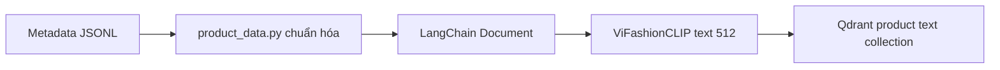
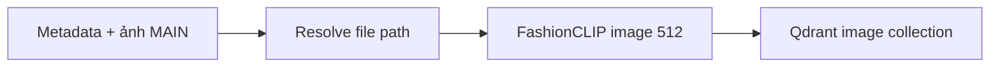
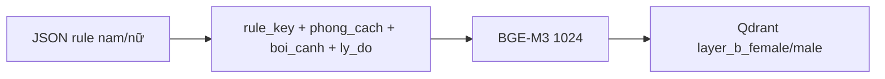

# Dữ liệu, embedding và indexing

## Ba kho vector độc lập về ý nghĩa

| Collection | Dữ liệu | Model index/query | Dimension |
|---|---|---|---:|
| `fashion_products_vifashionclip_vi_65k_structured_vi` | Metadata sản phẩm | ViFashionCLIP text | 512 |
| `fashion_products_fashionclip_image_main_65k` | Ảnh MAIN sản phẩm | FashionCLIP image | 512 |
| `layer_b_female`, `layer_b_male` | Rule stylist | BGE-M3 | 1024 |

Hai collection Layer A cùng nói về sản phẩm nhưng phục vụ hai loại query. Hai collection Layer B chứa tri thức phối, không chứa catalog thương mại.

## Pipeline Layer A text



`build_product_metadata()` giữ các trường dùng cho card/filter. `build_product_page_content()` tạo text semantic để embedding. Khi query, phải dùng đúng ViFashionCLIP text encoder đã tương thích với collection.

## Pipeline Layer A image



Indexer nằm trong `app/core/image_search.py`; notebook giải thích là `04_image_retrieval_debug.ipynb`. Không tự index lại khi chỉ muốn search. Chỉ chạy index pipeline khi tạo mới collection hoặc thay model/ảnh/payload.

## Pipeline Layer B



`ensure_layer_b_indexed()` chỉ tạo collection nếu chưa tồn tại. `index_layer_b(..., recreate=True)` mới xóa và tạo lại; không dùng tùy tiện trong web app.

## Hợp đồng payload sản phẩm

Các trường tối thiểu nên có:

```json
{
  "product_id": "B004BFZPAU",
  "title": "Tên sản phẩm",
  "brand": "Thương hiệu",
  "price": 299000,
  "category": "Áo",
  "images": ["images/...jpg"],
  "image_url": "images/..._MAIN.jpg"
}
```

`normalize_product_metadata()` xử lý `images` dạng list, JSON string hoặc dict và chọn main image ổn định.

## Khi nào bắt buộc index lại?

- Đổi embedding model hoặc checkpoint.
- Đổi vector dimension.
- Thay đổi nội dung semantic được đưa vào embedding đáng kể.
- Thêm/xóa lượng lớn sản phẩm hoặc ảnh.
- Sửa toàn bộ schema payload mà runtime cần.

Không cần index lại khi chỉ đổi prompt LLM, CSS, router keyword, SSE hoặc cách hiển thị card.

## Kiểm tra trước khi dùng collection

1. Tên collection khớp `app/config.py`.
2. Dimension khớp 512/1024.
3. Distance là cosine theo index hiện tại.
4. Số point hợp lý.
5. Một point mẫu có đủ payload card.
6. Query mẫu trả đúng category và ảnh mở được.

## Notebook liên quan

- `02_product_data_pipeline.ipynb`: chuẩn hóa dữ liệu.
- `03_layer_a_text_retrieval_debug.ipynb`: Layer A text.
- `04_image_retrieval_debug.ipynb`: Layer A image.
- `05_layer_b_outfit_and_category_mapping_v2.ipynb`: Layer B và mapping.

