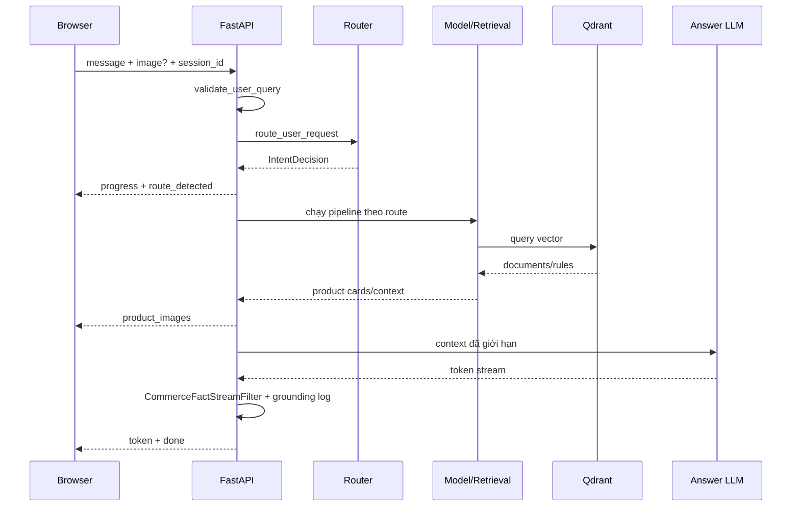

# Luồng xử lý một request

## Điểm vào

`POST /api/chat` trong `app/api.py` nhận multipart form: `message`, `session_id`, `image`, `developer_mode`. Kết quả được stream bằng Server-Sent Events.

## Luồng chung



## Text product search

1. Validation text.
2. Router tạo `product_discovery + text + action`.
3. `resolve_route()` trả `text_product_search`.
4. ViFashionCLIP encode query; Qdrant lấy 15 candidates.
5. Optional reranker, dedupe product ID, giới hạn lặp brand, chọn tối đa 5.
6. API gửi card ngay khi context xuất hiện.
7. LLM giải thích vì sao các lựa chọn phù hợp.
8. Filter bỏ mọi dòng mã/giá/thương hiệu/ảnh do LLM tự viết.

## Image product search

Nếu người dùng ghi rõ “tìm giống ảnh”, router đi thẳng `image_product_search`. Nếu chỉ gửi ảnh:

1. `inspect_image` yêu cầu `image_context`.
2. Qwen-VL mô tả subject/fashion item.
3. Nếu nhận ra món đủ rõ, mặc định tìm tương tự và đồng thời đưa CTA phối đồ.
4. FashionCLIP local encode ảnh.
5. Qdrant image collection trả catalog matches.

Nếu người dùng hỏi trực tiếp “Sản phẩm này là gì?”, action `identify_image_item` chạy VLM trước để trả lời tên/đặc điểm nhìn thấy được, rồi dùng chính route `image_product_search` lấy catalog matches. Luồng này không gọi answer LLM: VLM observation tạo câu trả lời thận trọng, card cung cấp dữ liệu thương mại, sau đó UI đưa lựa chọn xem kết quả hoặc phối đồ.

## Text outfit

1. Router chọn `text_outfit_advice`.
2. BGE-M3 encode yêu cầu và tìm một rule Layer B phù hợp.
3. Rule xác định tối đa ba slot cần phối.
4. Các query slot được batch encode bằng ViFashionCLIP.
5. Layer A trả một sản phẩm chính và lựa chọn thay thế cho mỗi slot.
6. Card outfit xuất hiện trước; LLM viết phần tư vấn sau.

## Image outfit

1. FashionCLIP tìm một catalog item gần ảnh làm món gốc.
2. Hệ thống suy category/thuộc tính của món gốc.
3. Layer B tìm công thức phối quanh món đó.
4. Layer A lấy các món bổ sung, không lấy ba món từ cùng category đầu tiên.
5. UI tách “món làm điểm bắt đầu” và “set đồ được chọn”.

## Profile analysis

1. VLM phân tích ảnh người dùng.
2. Kết quả được sanitize thành candidate profile.
3. Candidate chưa được lưu ngay.
4. UI hỏi người dùng xác nhận.
5. Chỉ action `confirm_candidate` mới cập nhật state profile.

## Thứ tự ưu tiên khi debug

```text
validation
→ decision.intent/action/modality
→ decision.route/certainty/source/trace
→ embedding call
→ Qdrant candidates
→ selected cards
→ LLM context
→ grounding filter/log
→ SSE/UI rendering
```

Không debug prompt LLM trước khi xác nhận retrieval đã đưa đúng sản phẩm.
