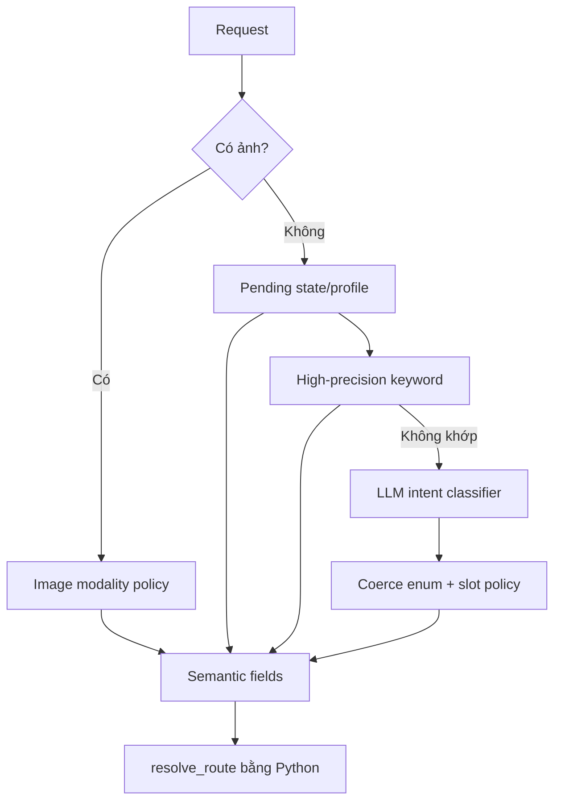

# Intent, Decision, Route và Slot Policy

## Bốn khái niệm không được trộn

```text
intent   = người dùng muốn đạt mục tiêu gì
modality = người dùng cung cấp text/ảnh/cả hai
action   = thao tác cụ thể trong intent
route    = pipeline Python sẽ chạy
```

Ví dụ “phối đồ với chiếc áo trong ảnh”:

```json
{
  "intent": "outfit_advice",
  "modality": "text_image",
  "action": "style_image_item",
  "route": "image_outfit_advice"
}
```

Ví dụ “Sản phẩm trong ảnh này là gì?” dùng cùng intent tìm sản phẩm, không dùng profile:

```json
{
  "intent": "product_discovery",
  "modality": "text_image",
  "action": "identify_image_item",
  "route": "image_product_search"
}
```

`profile_analysis` chỉ dành cho dáng người/tone da. `identify_image_item` dùng VLM để mô tả món đồ và FashionCLIP để tìm catalog match, nhờ vậy không cần thêm intent hoặc route thứ chín.

## Trình tự router



## Keyword có dấu và không dấu

`keyword_hit()` so khớp tại word/phrase boundary. Category có bảng spelling dấu riêng để phân biệt:

- `áo` không khớp substring trong `báo cáo`.
- `đầm` không bị suy từ `đảm bảo`.
- Câu không dấu như `ao thun den` vẫn hoạt động.

Không thêm keyword ngắn bằng phép `in query`; phải thêm test false-positive tương ứng.

## Vai trò của LLM router

LLM chỉ trả `intent`, `action`, `rewrite_query`, `entities`, `reason`. Prompt không yêu cầu confidence và không cho model quyết định slot bắt buộc hoặc route.

`coerce_intent_decision()`:

1. Loại intent ngoài enum.
2. Loại action không phù hợp intent.
3. Bỏ qua `confidence`/`missing_slots` nếu model cũ vẫn trả.
4. Gọi Python slot policy.
5. Gọi `resolve_route()`.

## `certainty`, `source`, `trace`

`certainty` là mức có ý nghĩa vận hành, không phải phần trăm:

| Certainty | Khi nào |
|---|---|
| `deterministic` | keyword/policy rõ ràng |
| `contextual` | state, modality hoặc VLM context |
| `llm_assisted` | LLM phân loại câu mơ hồ |
| `clarification_required` | chưa thể chọn workflow an toàn |

`source` ghi cơ chế tạo decision, ví dụ `keyword`, `state`, `modality_keyword`, `image_context_default`, `llm`. `source` không tạo decision; nó là provenance để debug.

`trace` chỉ chứa stage/result/detail quan sát được, không lưu chain-of-thought.

## Slot policy

Chỉ bốn slot được phép chặn execution:

| Slot | Ý nghĩa |
|---|---|
| `user_goal` | Chưa biết muốn tìm hay phối |
| `previous_search` | “Xem thêm” nhưng không có lượt trước |
| `image_context` | Có ảnh nhưng VLM chưa quan sát |
| `image_goal` | Đã nhìn ảnh nhưng chưa biết mục tiêu |

Category, màu, size, budget, brand và occasion là optional filter. Thiếu chúng không làm bot hỏi dồn; retrieval vẫn chạy và chỉ hỏi thêm khi mục tiêu chính mơ hồ.

## Hợp đồng `IntentDecision`

| Field | Ai tạo | Dùng để làm gì |
|---|---|---|
| `intent/action/modality` | rule hoặc LLM đã coerce | semantic decision |
| `route` | `resolve_route()` | chọn pipeline |
| `handler` | property từ route | compatibility với API branch |
| `rewrite_query` | rule/LLM | query retrieval độc lập |
| `entities` | regex/rule/LLM | filter và progress UI |
| `image_context` | VLM policy | tiếp tục luồng ảnh |
| `missing_slots` | Python policy | lý do hỏi lại |
| `certainty/source/trace` | router policy | audit/debug |
| `workflow` | Python | multi-stage profile → outfit |

`confidence` vẫn tồn tại để notebook cũ không vỡ nhưng đã deprecated; code mới không được dùng nó để chọn route.

## Cách thêm intent/action mới

1. Chứng minh không thể biểu diễn bằng intent hiện có.
2. Thêm enum/action set.
3. Cập nhật `resolve_route()`.
4. Cập nhật LLM schema nếu cần.
5. Thêm positive, negative, accented, unaccented và follow-up cases.
6. Cập nhật tài liệu này và notebook 08.
