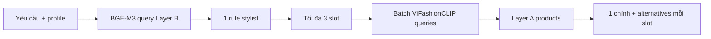

# Retrieval và phối đồ Layer A/Layer B

## Text retrieval

`get_fast_search_chain()` dùng query đã được router chuẩn hóa và bỏ một lượt LLM rewrite để giảm latency. Retriever thực hiện:

```text
query
→ ViFashionCLIP text vector
→ Qdrant top 15
→ optional cross-encoder rerank
→ dedupe product_id
→ giới hạn lặp thương hiệu
→ tối đa 5 cards
```

Nếu Qdrant lỗi, `safe_base_retrieve()` retry rồi trả danh sách rỗng thay vì làm crash toàn chat.

## Image retrieval

`FashionCLIPImageEmbeddings` encode ảnh upload thành vector 512. `search_products_by_image()` query collection ảnh MAIN, áp score threshold, chuẩn hóa payload thành `Document` và giới hạn số product trả về.

VLM không thay thế image embedding. VLM mô tả ảnh để chọn mục tiêu/route; FashionCLIP chịu trách nhiệm đo độ giống ảnh catalog.

## Outfit text



`find_matching_rule()` ưu tiên gender/profile và fallback có kiểm soát khi score thấp. `get_layer_a_categories()` ánh xạ category tri thức sang category catalog. `get_products_for_outfit_batch()` batch embedding để tránh gọi model tuần tự cho từng slot.

## Outfit ảnh

`analyze_image_item_context()` dùng catalog matches để suy món gốc. Nếu tín hiệu yếu, nó đánh dấu cần VLM. `build_layer_b_query_from_image_context()` tạo query rule; sau đó luồng giống outfit text nhưng loại/kiểm soát slot trùng món gốc.

## Quy tắc chọn card

- Search text: tối đa 5 sản phẩm đa dạng.
- Search ảnh: mặc định tối đa 3 matches.
- Outfit: tối đa 3 slot; mỗi slot một sản phẩm chính.
- Mỗi slot có tối đa hai alternatives để nút “Xem các lựa chọn khác” sử dụng.
- Product ID là khóa dedupe và liên kết đúng bộ ảnh.

## Phân biệt score

- Qdrant similarity score đo gần vector trong một collection cụ thể.
- VLM confidence đo độ chắc của quan sát ảnh do model trả về.
- Outfit context confidence là heuristic tổng hợp để quyết định có cần VLM.
- Router `certainty` mô tả nguồn quyết định.

Bốn khái niệm này không cùng thang đo và không được so sánh trực tiếp.

## Debug chất lượng retrieval

Ghi lại ít nhất:

```text
raw query / rewritten query
embedding backend + số vector
collection
top candidate IDs + similarity score
filter payload
rerank enabled?
selected IDs sau dedupe/diversity
card slot/category
```

Nếu LLM trả lời không hợp, kiểm tra selected documents trước prompt. Nếu documents sai, lỗi nằm ở retrieval/index/mapping; sửa prompt sẽ không giải quyết gốc.

