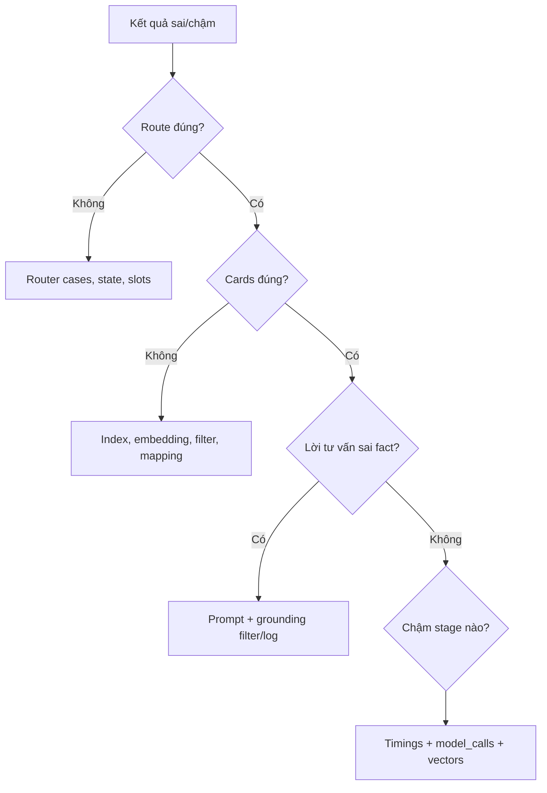

# Debugging, logging và quan sát hệ thống

## Developer Mode

Bật Developer Mode để xem:

- intent, action, modality, route;
- `source` và `certainty`;
- entities/filter;
- router trace;
- thời gian từng stage;
- số model call và số vector;
- grounding lines bị lọc.

Không dùng trường `confidence` cũ để kết luận router đúng hay sai.

## Log files

| File | Nội dung |
|---|---|
| `logs/chat_turns_research_demo_v3.jsonl` | mỗi turn: route, retrieval IDs, timing, calls, grounding |
| hallucination file từ `HALLUCINATION_LOG_FILE` | product ID lạ do LLM nhắc |

Không commit log có dữ liệu người dùng thật. Log hiện phục vụ nghiên cứu/demo, chưa có rotation hoặc retention policy production.

## Cây chẩn đoán



## Chẩn đoán latency

| Stage chậm | Khả năng |
|---|---|
| `router` | câu rơi vào LLM fallback hoặc tunnel chậm |
| `vlm_image_understanding` | Qwen-VL load/inference |
| `image_retrieval` | FashionCLIP cold start hoặc Qdrant |
| `product_retrieval` | embedding service/Qdrant/reranker |
| `outfit_retrieval` | BGE + nhiều Layer A slot queries |
| `answer_chain` | LLM prefill/generation |

Cards xuất hiện trước answer LLM nên `total` dài không đồng nghĩa người dùng chờ trắng toàn bộ thời gian.

## Các kiểm tra nhanh

```powershell
python -m compileall -q app
python -m unittest discover -s tests -p "test_*.py" -v
```

Kiểm tra endpoint service bằng công cụ phù hợp với môi trường, sau đó chạy một câu deterministic để tách lỗi router LLM khỏi retrieval.

## Lỗi router

1. Ghi câu lỗi vào `tests/router_eval_cases.jsonl`.
2. Thêm expected intent/action/route hoặc `fast_match=false`.
3. Sửa boundary/policy, không thêm substring tùy tiện.
4. Chạy toàn bộ test.
5. Quan sát `trace` trên app.

## Lỗi grounding

- Nếu card sai: sửa retrieval/payload.
- Nếu card đúng nhưng lời LLM tự ghi giá/mã: kiểm tra prompt và `grounding_filter`.
- Nếu `unknown_ids` xuất hiện: kiểm tra context thật được đưa vào LLM và pattern trích ID.
- Không retry LLM chỉ để sửa một fact thương mại; card đã cung cấp fact chính xác và retry làm tăng latency.

## Thông tin cần đính kèm khi bàn giao bug

```text
query + có ảnh hay không
session state liên quan
decision event
top retrieved IDs/scores
product card payload
timings/model_calls
answer đã lọc
grounding report/error stack
```

