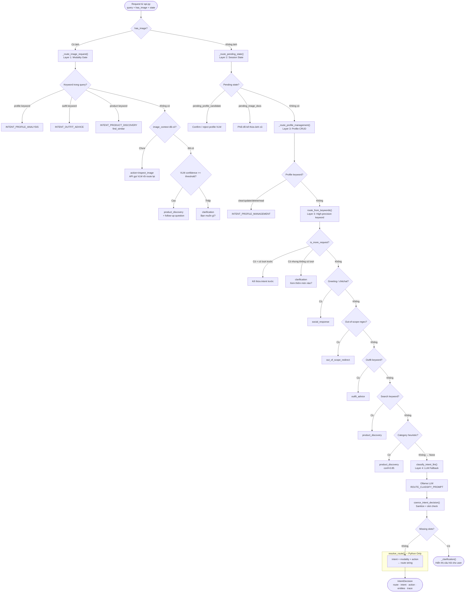

# INTENT_MODULE.md — Deep Dive: `app/core/intent.py`

> **Mục tiêu**: Giúp developer (mới hoặc cũ) hiểu rõ module `intent.py` hoạt động ra sao,
> tại sao mỗi quyết định thiết kế lại được thực hiện như vậy, và cách mở rộng không phá vỡ hệ thống hiện tại.

---

## Mục lục

1. [Tổng quan vai trò](#1-tổng-quan-vai-trò)
2. [Triết lý thiết kế — 4 khái niệm cốt lõi](#2-triết-lý-thiết-kế)
3. [Luồng routing toàn cảnh (Mermaid)](#3-luồng-routing-toàn-cảnh)
4. [Nhóm 1 — Constants và IntentDecision](#4-nhóm-1--constants-và-intentdecision)
5. [Nhóm 2 — Text Normalization](#5-nhóm-2--text-normalization)
6. [Nhóm 3 — Entity Extraction](#6-nhóm-3--entity-extraction)
7. [Nhóm 4 — Routing Logic Layer 1–3](#7-nhóm-4--routing-logic-layer-13)
8. [Nhóm 5 — LLM Fallback Layer 4 và Public API](#8-nhóm-5--llm-fallback-và-public-api)
9. [Bảng Mapping Intent × Modality → Route](#9-bảng-mapping)
10. [Slot Policy — Tại sao chỉ 4 slot?](#10-slot-policy)
11. [Hướng dẫn mở rộng](#11-hướng-dẫn-mở-rộng)
12. [Glossary](#12-glossary)

---

## 1. Tổng quan vai trò

`intent.py` là **bộ định tuyến trung tâm** của toàn hệ thống.
Mọi request của người dùng đều phải đi qua đây trước khi chạm vào bất kỳ pipeline nào khác.

```
api.py  →  intent.py  →  [text_search | image_search | outfit | profile | social | redirect]
```

**3 loại input module xử lý**:

| Input | Mô tả | Ví dụ |
|-------|-------|--------|
| Text only | Tin nhắn văn bản | `"tìm áo thun đen"` |
| Image only | Người dùng gửi ảnh không caption | Upload ảnh |
| Text + Image | Ảnh kèm mô tả | `"phối đồ với món này"` + ảnh |

---

## 2. Triết lý thiết kế

### 4 khái niệm không được nhầm lẫn

```
INTENT   = "Người dùng muốn đạt mục tiêu nghiệp vụ gì?"
           (product_discovery / outfit_advice / profile_management / social / out_of_scope)

MODALITY = "Họ cung cấp kiểu đầu vào nào?"
           (text / image / text_image)

ACTION   = "Thao tác cụ thể nào bên trong intent?"
           (search / find_similar / identify_image_item / create_outfit / style_image_item / update / read / ...)

ROUTE    = "Pipeline kỹ thuật nào sẽ chạy?"
           (text_product_search / image_product_search / text_outfit_advice / ...)
```

> [!IMPORTANT]
> `route` **luôn luôn** được quyết định bởi Python function `resolve_route()`.
> LLM **không bao giờ** được chọn `route` trực tiếp.

### Tại sao tách `intent` và `route`?

- **Intent** là khái niệm nghiệp vụ — ổn định theo thời gian.
- **Route** là chi tiết kỹ thuật — có thể thay đổi khi refactor hạ tầng.
- Tách rời cho phép đổi pipeline (ví dụ từ Qdrant sang Elasticsearch) mà không cần sửa LLM prompt.

### Tại sao ưu tiên keyword trước LLM?

| Tiêu chí | Keyword | LLM |
|----------|---------|-----|
| Độ trễ (latency) | ~0ms | ~300–800ms |
| Predictability | 100% | ~95% |
| Chi phí | Miễn phí | CPU/GPU |
| False positive | Kiểm soát được | Khó kiểm soát |

> LLM chỉ là **lưới an toàn** cho những câu mơ hồ, không phải lựa chọn mặc định.

---

## 3. Luồng routing toàn cảnh



---

## 4. Nhóm 1 — Constants và `IntentDecision`

### 4.1 Constants hệ thống

Tất cả giá trị enum được định nghĩa như `str` constant thông thường (không dùng `Enum` class) để code gọi dễ debug hơn.

| Nhóm | Prefix | Ví dụ |
|------|--------|--------|
| Intent | `INTENT_*` | `INTENT_PRODUCT_DISCOVERY`, `INTENT_OUTFIT_ADVICE` |
| Route | `ROUTE_*` | `ROUTE_TEXT_PRODUCT_SEARCH`, `ROUTE_IMAGE_OUTFIT_ADVICE` |
| Modality | `MODALITY_*` | `MODALITY_TEXT`, `MODALITY_IMAGE`, `MODALITY_TEXT_IMAGE` |
| Certainty | `CERTAINTY_*` | `CERTAINTY_DETERMINISTIC`, `CERTAINTY_LLM_ASSISTED` |

```python
# Nên dùng constant thay vì hard-code string
if decision.route == ROUTE_TEXT_PRODUCT_SEARCH:   # ✅ Đúng
    ...
if decision.route == "text_product_search":        # ❌ Tránh
    ...
```

### 4.2 `IntentDecision` dataclass

Đối tượng duy nhất trả về bởi router. Có 2 loại:

**Decision có thể thực thi** (`needs_clarification=False`):
```python
IntentDecision(
    intent="product_discovery",
    modality="text",
    action="search",
    route="text_product_search",   # pipeline sẽ chạy
    entities={"colors": ["den"], "categories": ["ao thun"]},
    certainty="deterministic",
    source="keyword",
    rewrite_query="tìm áo thun đen",
)
```

**Decision yêu cầu làm rõ** (`needs_clarification=True`):
```python
IntentDecision(
    intent="unknown",
    route=None,                         # không có route
    needs_clarification=True,
    missing_slots=["user_goal"],
    clarification_question="Bạn muốn tìm sản phẩm hay phối đồ?",
    clarification_options=[...],
)
```

**Properties đáng chú ý**:

| Property | Mô tả |
|----------|-------|
| `.handler` | Cố định `str` cho API switch (legacy, không thêm mới) |
| `.is_image_route` | True nếu pipeline xử lý ảnh |
| `.is_product_route` | True nếu pipeline là search sản phẩm |
| `.is_outfit_route` | True nếu pipeline là outfit advice |
| `.is_profile_route` | True nếu pipeline là quản lý profile |

> [!NOTE]
> `confidence` vẫn có mặt trong dataclass nhưng đã **deprecated**.
> Code mới không được dùng `confidence` để ra quyết định.
> Thay vào đó dùng `certainty` + `source`.

---

## 5. Nhóm 2 — Text Normalization

Module xử lý text qua 3 dạng có mục đích riêng:

```
query gốc           : "Tìm áo thun ĐEN và TRẮNG"
                       ↓ normalize_text()
quản lý accent NFD  : "tìm áo thun đen và trắng"   ← dùng để khớp có dấu
                       ↓ plain_text()
không dấu lowercase : "tim ao thun den va trang"    ← dùng để khớp không dấu
```

### Các hàm matching

| Hàm | Dùng khi | Phương pháp |
|-----|----------|------------|
| `phrase_hit(text, phrase)` | Khớp cụm từ chính xác | Word boundary regex |
| `keyword_hit(text, keywords)` | Khớp 1 trong nhiều từ | OR các phrase_hit |
| `word_hit(text, word)` | Khớp 1 từ đơn | `\b...\b` regex |

> [!WARNING]
> **Không bao giờ** dùng `if keyword in query` mà không có word boundary.
> `"áo" in "báo cáo"` → True, gây false positive.

---

## 6. Nhóm 3 — Entity Extraction

### 6.1 Vấn đề đặc thù tiếng Việt

**Thách thức 1: Đồng âm khác nghĩa**

| Từ | Nghĩa | Khi bỏ dấu |
|----|-------|------------|
| `tìm` | động từ tìm kiếm | → `tim` |
| `tím` | màu tím | → `tim` |

Giải pháp trong `extract_color_entities()` — **logic 3 tầng**:
```
1. accented_hit  : tìm "tím" → chắc chắn là màu
2. contextual_hit: tìm "màu tim", "tone tim" → ngữ cảnh màu
3. modifier_hit  : tìm "tim pastel", "tim đậm" → từ bổ nghĩa màu
→ Chỉ khi ít nhất 1 tầng match thì màu mới được ghi nhận
```

**Thách thức 2: Danh mục vs. từ thông thường**

| Từ | Nghĩa sản phẩm | Dễ nhầm với |
|----|----------------|-------------|
| `đầm` | váy đầm | `đảm bảo` |
| `áo` | áo mặc | `báo cáo`, `tháo` |

Giải pháp trong `category_hit()`: Kiểm tra cả dạng accent-free VÀ dạng có dấu chính xác trong `CATEGORY_ACCENTED_FORMS`.

### 6.2 Entities không chặn luồng

```
colors, categories, occasions, sizes, budget_text
```

Đây là **optional filter** — bot KHÔNG hỏi thêm khi thiếu chúng. Retrieval pipeline vẫn chạy với filter rỗng.

---

## 7. Nhóm 4 — Routing Logic Layer 1–3

### Layer 1: Modality Gate — `_route_image_request()`

Cây quyết định khi có ảnh (theo thứ tự ưu tiên):
```
1. profile + outfit keyword  → analyze_then_style (workflow 2 bước: VLM phân tích → gợi ý outfit)
2. profile keyword           → INTENT_PROFILE_ANALYSIS (analyze_body / analyze_full_profile)
3. outfit keyword            → INTENT_OUTFIT_ADVICE (style_image_item)
4. identify keyword          → INTENT_PRODUCT_DISCOVERY (identify_image_item)
                               VLM chưa chạy → inspect_image trước
                               VLM đã chạy   → dùng caption để build search_query
5. product keyword/category  → INTENT_PRODUCT_DISCOVERY (find_similar)
6. image_context is None     → action=inspect_image [API phải gọi VLM trước]
7. VLM confidence >= threshold → product_discovery (find_similar) + follow-up question
8. VLM confidence < threshold  → clarification (hỏi user muốn gì)
```

> [!NOTE]
> **Trường hợp 6** là đặc biệt: hàm trả về `action="inspect_image"` với `route=None`.
> `api.py` phải gọi VLM, lấy kết quả, rồi gọi lại router với `image_context` đã có.
> Đây là **2-pass routing** cho image request.
>
> **Trường hợp 4 (identify)** cũng dùng 2-pass nếu VLM chưa chạy, nhưng sau khi có
> `image_context`, router dùng `caption` làm `search_query` và route vào `image_product_search`.
> Entities được bổ sung thêm `identified_item` và `image_caption` để UI hiển thị kết quả nhận diện.

### Layer 2: Session State — `_route_pending_state()`

```
pending_profile_candidate → "ok / đúng rồi"   → confirm_candidate
                          → "không / bỏ qua"  → reject_candidate

pending_image_docs        → outfit keyword     → style_image_item (kế thừa ảnh cũ)
                          → từ hủy            → social (xóa pending image)
```

### Layer 3: Keyword Routing — `route_from_keywords()`

| Bước | Kiểm tra | Kết quả |
|------|----------|---------|
| 1 | `has_image` | `_route_image_request()` |
| 2 | Pending state | `_route_pending_state()` |
| 3 | Profile keyword | `_route_profile_management()` |
| 4 | `is_more_request()` | Kế thừa lượt trước / clarification |
| 5 | `DEFINITE_GREETING` | `social → greeting` |
| 6 | `DEFINITE_CHITCHAT` | `social → thanks/goodbye` |
| 7 | `strict_out_of_scope_hit()` | `out_of_scope_redirect` |
| 8 | `DEFINITE_OUTFIT` | `outfit_advice → create_outfit` |
| 9 | `DEFINITE_SEARCH` | `product_discovery` |
| 10 | Category heuristic | `product_discovery` (conf=0.85) |
| 11 | `None` | → LLM (Layer 4) |

> [!IMPORTANT]
> `resolve_route()` là hàm **duy nhất được phép** gán `route`.
> Không viết `decision.route = "..."` ở bất kỳ đâu khác trong codebase.

---

## 8. Nhóm 5 — LLM Fallback và Public API

### `coerce_intent_decision()` — Bộ lọc output LLM

```
LLM output (không đáng tin) → coerce_intent_decision() → IntentDecision (đáng tin)

Bước 1: Validate intent ∈ BUSINESS_INTENTS, nếu không → INTENT_UNKNOWN
Bước 2: Bỏ qua confidence LLM tự báo (ghi log để debug)
Bước 3: Kiểm tra missing slots (Python policy, không phải LLM)
Bước 4: Coerce action về giá trị hợp lệ cho intent đó
Bước 5: Gọi resolve_route() để lấy route
```

### `route_user_request()` — Điểm vào duy nhất

```python
# api.py chỉ gọi hàm này
decision = route_user_request(
    query=query,
    last_bot_msg=last_bot_msg,
    state=state,
    has_image=has_image,
    image_context=image_context,
)
```

Thứ tự thực thi:
```
force_image_search=True  →  lock ROUTE_IMAGE_PRODUCT_SEARCH ngay lập tức
         ↓
route_from_keywords()    →  Layer 1–3 (deterministic/contextual)
         ↓ nếu None
classify_intent_llm()   →  Layer 4 (LLM Ollama)
         ↓
IntentDecision
```

---

## 9. Bảng Mapping

### Intent × Modality/Action → Route

| Intent | Modality / Action | Route | Pipeline |
|--------|------------------|-------|---------|
| `product_discovery` | `image` hoặc `text_image` | `image_product_search` | CLIP vector search bằng ảnh |
| `product_discovery` | `action=find_similar` | `image_product_search` | Tìm sản phẩm tương tự ảnh |
| `product_discovery` | `action=identify_image_item` | `image_product_search` | VLM nhận diện món đồ → search catalog |
| `product_discovery` | `text` | `text_product_search` | Text vector search |
| `outfit_advice` | `image/text_image` + `style_image_item` | `image_outfit_advice` | Phối đồ từ item trong ảnh |
| `outfit_advice` | `text` | `text_outfit_advice` | LLM gợi ý outfit từ text |
| `profile_analysis` | `analyze_then_style` | `profile_vlm_analysis` → `text_outfit_advice` | Workflow 2 bước: phân tích + outfit |
| `profile_analysis` | các action khác | `profile_vlm_analysis` | VLM phân tích người trong ảnh |
| `profile_management` | bất kỳ | `profile_state_handler` | CRUD profile database |
| `social` | bất kỳ | `social_response` | Template cố định |
| `out_of_scope` | bất kỳ | `out_of_scope_redirect` | Thông báo + hướng dẫn |

### Certainty × Source

| Certainty | Source | Ý nghĩa |
|-----------|--------|---------|
| `deterministic` | `keyword`, `keyword_heuristic` | Từ khóa chính xác cao |
| `contextual` | `state`, `modality_gate`, `image_context_default`, `image_context_identify` | Session, VLM default, hoặc VLM nhận diện trực tiếp |
| `llm_assisted` | `llm` | LLM phân loại |
| `clarification_required` | bất kỳ | Chưa thể chọn pipeline an toàn |

---

## 10. Slot Policy

> [!WARNING]
> Không được thêm slot blocking mới mà không xem xét kỹ.
> Slot blocking = bot hỏi dồn người dùng = trải nghiệm tồi.

### 4 slot được phép chặn thực thi

| Slot | Lý do chặn | Ví dụ |
|------|-----------|-------|
| `user_goal` | Không biết tìm hay phối đồ → không thể chọn pipeline | "cho tôi xem mấy cái đó" |
| `previous_search` | "Xem thêm" nhưng không có lịch sử → không biết xem thêm gì | Lần đầu dùng mà gõ "thêm nữa" |
| `image_context` | Có ảnh nhưng VLM chưa phân tích → không biết ảnh là gì | Gửi ảnh không caption |
| `image_goal` | VLM đã phân tích nhưng confidence thấp → không chắc mục tiêu | Ảnh mờ, chủ thể không rõ |

### Những gì KHÔNG bao giờ chặn

```
colors, categories, sizes, budget, occasions → bot vẫn tìm không lọc
```

---

## 11. Hướng dẫn mở rộng

### Thêm Intent mới

1. **Chứng minh** không thể dùng intent hiện có (6 intent hiện tại)
2. Thêm `INTENT_XXX = "xxx"` vào constants
3. Thêm vào `BUSINESS_INTENTS` set
4. Thêm action set `XXX_ACTIONS`
5. Thêm nhánh trong `resolve_route()`
6. Thêm keyword trong `DEFINITE_XXX` hoặc hàm detect riêng
7. Cập nhật `ROUTE_CLASSIFY_PROMPT` (LLM schema)
8. Viết test: positive, negative, có dấu, không dấu, follow-up

### Thêm Màu / Danh mục mới

```python
# Màu mới:
COLOR_KEYWORDS.append("olive")
COLOR_ACCENTED_WORDS["olive"] = []  # không có dạng có dấu khác

# Danh mục mới — luôn sắp xếp từ DÀI đến NGẮN:
CATEGORY_KEYWORDS.append("ao khoac da")  # trước "ao khoac"
CATEGORY_ACCENTED_FORMS["ao khoac da"] = ["áo khoác da"]
```

> [!TIP]
> Luôn sắp xếp `CATEGORY_KEYWORDS` từ **dài đến ngắn** để khớp cụ thể nhất trước.
> `"ao thun"` phải đứng trước `"ao"` để tránh false positive.

---

## 12. Glossary

| Thuật ngữ | Định nghĩa |
|-----------|-----------|
| **Intent** | Mục tiêu nghiệp vụ của người dùng |
| **Modality** | Kiểu đầu vào: text / image / text_image |
| **Action** | Thao tác cụ thể bên trong intent |
| **Route** | ID của pipeline kỹ thuật sẽ chạy |
| **Handler** | String legacy tương thích ngược cho API switch |
| **Certainty** | Mức độ chắc chắn vận hành (không phải %) |
| **Source** | Cơ chế ra quyết định (để audit/debug) |
| **Trace** | Chuỗi bước quan sát được trong quá trình routing |
| **Slot** | Thông tin cần thiết nhưng đang thiếu |
| **Blocking slot** | Slot có thể chặn thực thi và yêu cầu hỏi lại |
| **Optional filter** | Entity không chặn (màu, size, danh mục, ...) |
| **VLM** | Vision Language Model — phân tích nội dung ảnh |
| **CLIP** | Mô hình embedding ảnh dùng cho image search |
| **Pending state** | Trạng thái session đang chờ xác nhận từ người dùng |
| **2-pass routing** | Router chạy 2 lần: lần 1 phát hiện cần VLM, lần 2 route sau VLM |
| **Coerce** | Ép giá trị về tập hợp hợp lệ (dùng với output LLM) |
