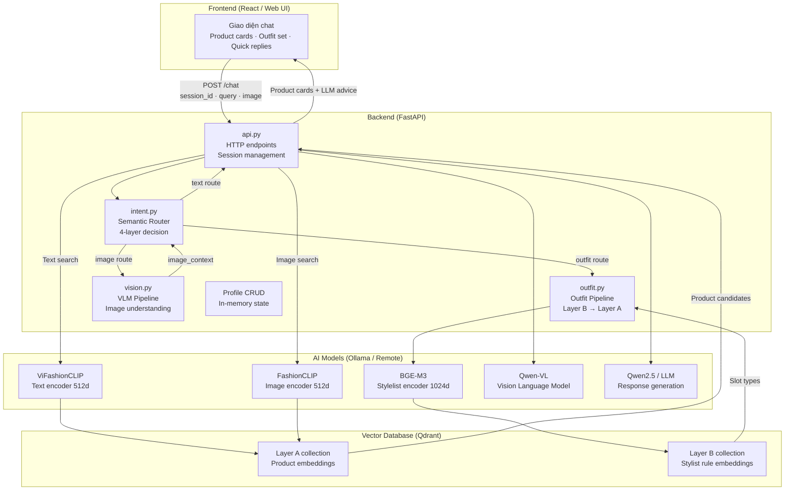
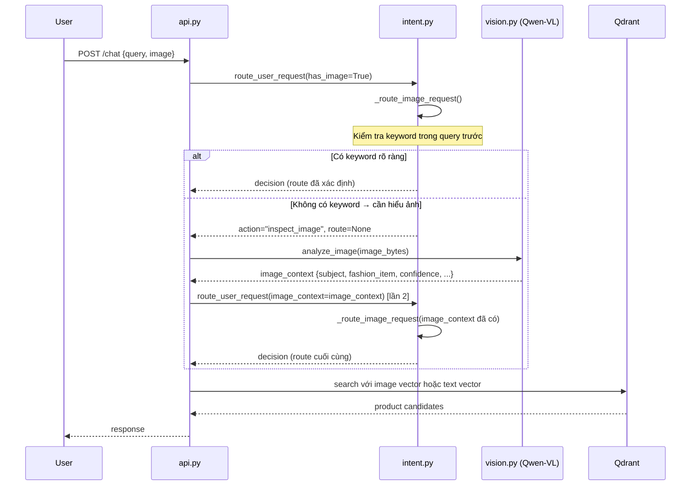

# SYSTEM_ARCHITECTURE.md — Kiến trúc tổng thể Chatbot Fashion

> **Mục tiêu**: Tổng quan kiến trúc toàn hệ thống — setup, luồng xử lý, vai trò từng module,
> cách các thành phần kết nối với nhau, và các quyết định thiết kế quan trọng.

---

## Mục lục

1. [Bức tranh toàn cảnh](#1-bức-tranh-toàn-cảnh)
2. [Cấu trúc thư mục](#2-cấu-trúc-thư-mục)
3. [Setup và cấu hình](#3-setup-và-cấu-hình)
4. [Các thành phần chính](#4-các-thành-phần-chính)
5. [Luồng xử lý request đầu-cuối](#5-luồng-xử-lý-request)
6. [Hai lớp tri thức (Layer A và Layer B)](#6-hai-lớp-tri-thức)
7. [Luồng xử lý ảnh (2-pass routing)](#7-luồng-xử-lý-ảnh)
8. [Session State và Memory](#8-session-state-và-memory)
9. [Mô hình AI sử dụng](#9-mô-hình-ai-sử-dụng)
10. [Developer Mode và Observability](#10-developer-mode)

---

## 1. Bức tranh toàn cảnh



---

## 2. Cấu trúc thư mục

```
Chatbot_Fashion/
├── app/
│   ├── api.py              ← FastAPI app, HTTP endpoints, main orchestrator
│   ├── config.py           ← Tập trung toàn bộ cấu hình (URLs, model names, keywords)
│   └── core/
│       ├── intent.py       ← Semantic router (module chính, ~2000 dòng)
│       ├── outfit.py       ← Outfit pipeline (Layer B → Layer A)
│       └── vision.py       ← VLM image understanding
├── docs/                   ← Tài liệu hệ thống (file này đang ở đây)
├── scripts/                ← Script indexing, data ingestion
├── frontend/               ← React web UI
└── requirements.txt
```

---

## 3. Setup và cấu hình

### 3.1 File cấu hình trung tâm: `config.py`

**Tất cả** URLs, model names, collection names, keyword lists đều nằm trong `config.py`.
Không được hard-code bất kỳ giá trị nào vào các module khác.

```python
# Ví dụ cấu hình trong config.py
OLLAMA_BASE_URL = "http://localhost:11434"
LLM_MODEL = "qwen2.5:7b"
VLM_MODEL = "qwen2-vl:7b"

QDRANT_HOST = "localhost"
QDRANT_PORT = 6333
QDRANT_PRODUCT_COLLECTION = "fashion_products_vifashionclip"
QDRANT_STYLIST_COLLECTION = "fashion_stylist_bge_m3"

# Keyword lists được import vào intent.py
DEFINITE_OUTFIT = ["phối đồ", "gợi ý outfit", "mặc với gì", ...]
DEFINITE_SEARCH = ["tìm", "xem", "mua", "cho tôi xem", ...]
```

### 3.2 Các dịch vụ cần chạy

| Dịch vụ | Cổng | Mục đích |
|---------|------|---------|
| FastAPI app | 8000 | Backend chính |
| Qdrant | 6333 | Vector database |
| Ollama | 11434 | LLM và VLM inference |
| ViFashionCLIP service | (remote) | Text embedding cho Layer A |

> [!NOTE]
> ViFashionCLIP thường chạy trên máy GPU riêng (Vast.ai hoặc local GPU).
> Xem `docs/REMOTE_VIFASHIONCLIP_SERVICE.md` để cấu hình kết nối remote.

---

## 4. Các thành phần chính

### 4.1 `api.py` — Orchestrator

**Vai trò**: Nhận request HTTP, điều phối toàn bộ luồng xử lý, trả về response.

**Trách nhiệm chính**:
- Parse và validate request (query, image, session_id)
- Gọi `route_user_request()` để lấy routing decision
- Dựa vào `decision.route`, gọi pipeline tương ứng
- Quản lý session state (lưu `last_route_decision`, `pending_*`)
- Format và trả về JSON response

**Điều `api.py` KHÔNG làm**:
- Không tự quyết định route
- Không gọi trực tiếp LLM mà không qua intent router
- Không chứa business logic (logic thuộc về `intent.py`, `outfit.py`, `vision.py`)

### 4.2 `intent.py` — Semantic Router

Xem [INTENT_MODULE.md](./INTENT_MODULE.md) để đọc chi tiết.

**Tóm tắt**: 4-layer decision pipeline.
- Layer 1: Modality gate (ảnh?)
- Layer 2: Session state (pending state?)
- Layer 3: Keyword routing (deterministic)
- Layer 4: LLM fallback (câu mơ hồ)

### 4.3 `outfit.py` — Outfit Pipeline

**Vai trò**: Gợi ý bộ trang phục (outfit set) dựa trên text hoặc ảnh.

**Luồng**:
```
1. Tìm outfit rule trong Layer B (BGE-M3 embedding)
   → Rule định nghĩa "set đồ này cần: áo + quần + giày + phụ kiện"

2. Với mỗi slot trong rule, tìm sản phẩm thật trong Layer A (CLIP embedding)
   → Sản phẩm thật từ kho hàng, không phải LLM tự nghĩ ra

3. LLM viết lời tư vấn dựa trên sản phẩm đã tìm được
   → LLM chỉ viết text, không chọn sản phẩm
```

> [!IMPORTANT]
> Thiết kế này đảm bảo **LLM không bao giờ bịa sản phẩm**.
> Mọi item trong outfit set đều là sản phẩm thật từ Qdrant Layer A.

### 4.4 `vision.py` — VLM Pipeline

**Vai trò**: Phân tích nội dung ảnh bằng Vision Language Model (Qwen-VL).

**Output của VLM** (gọi là `image_context`):
```python
{
    "subject": "fashion_item",      # "fashion_item" | "person" | "scene" | "unclear"
    "fashion_item": "áo khoác",     # tên món thời trang nếu nhận ra
    "caption": "áo khoác đen cổ V", # mô tả ngắn
    "dang_nguoi": "cao gầy",        # dáng người (nếu có người trong ảnh)
    "tone_da": "sáng",              # tone da
    "confidence": 0.85,             # độ tin cậy của VLM
    "colors_detected": ["đen"],     # màu sắc nhận ra
}
```

Kết quả này được truyền vào `_route_image_request()` để router có thể ra quyết định thông minh hơn.

---

## 5. Luồng xử lý request

### 5.1 Text request bình thường

```
User: "tìm áo thun đen size M"
         ↓
api.py nhận POST /chat
         ↓
route_user_request(query, state, has_image=False)
         ↓
route_from_keywords() → DEFINITE_SEARCH match → product_discovery / text / search
         ↓
resolve_route() → ROUTE_TEXT_PRODUCT_SEARCH
         ↓
api.py gọi ViFashionCLIP text encoder → vector 512d
         ↓
Qdrant search Layer A với filter: {colors: ["den"], sizes: ["M"]}
         ↓
Top-K product candidates
         ↓
Qwen LLM viết lời tư vấn dựa trên candidates (grounding policy)
         ↓
Response: {products: [...], advice: "...", follow_up: "..."}
```

### 5.2 Outfit request

```
User: "phối đồ đi làm với áo trắng tôi đang mặc"
         ↓
route_from_keywords() → DEFINITE_OUTFIT match → outfit_advice / text / create_outfit
         ↓
resolve_route() → ROUTE_TEXT_OUTFIT_ADVICE
         ↓
outfit.py:
  1. BGE-M3 encode query → tìm rule Layer B: "set đi làm: áo + quần + giày"
  2. Với mỗi slot, CLIP search Layer A → lấy sản phẩm thật
  3. Qwen LLM viết lời tư vấn phối đồ
         ↓
Response: {outfit_slots: [{type: "quần", products: [...]}, ...], advice: "..."}
```

### 5.3 Đồng thời gửi ảnh

Xem [Section 7](#7-luồng-xử-lý-ảnh) bên dưới.

---

## 6. Hai lớp tri thức

### Layer A — Kho sản phẩm

| Thuộc tính | Giá trị |
|-----------|---------|
| **Mục đích** | Lưu embedding của sản phẩm thật từ database |
| **Model** | ViFashionCLIP (Vietnamese-tuned CLIP) |
| **Chiều** | 512 chiều |
| **Collection** | `fashion_products_vifashionclip` |
| **Metadata** | tên, giá, thương hiệu, màu, size, danh mục, URL ảnh |
| **Cập nhật** | Khi thêm/sửa sản phẩm (batch indexing) |

### Layer B — Tri thức stylist

| Thuộc tính | Giá trị |
|-----------|---------|
| **Mục đích** | Lưu embedding của quy tắc phối đồ (outfit rules) |
| **Model** | BGE-M3 (multilingual) |
| **Chiều** | 1024 chiều |
| **Collection** | `fashion_stylist_bge_m3` |
| **Nội dung** | Rule dạng "set đi làm: áo sơ mi + quần tây + giày oxford" |
| **Cập nhật** | Khi thêm quy tắc stylist mới |

### Tại sao cần 2 layer riêng?

```
Câu hỏi: "Gợi ý outfit đi biển"
         ↓
Layer B tìm rule: "set đi biển gồm: áo phông + quần short + dép sandal"
                                      ↓           ↓              ↓
                              Layer A tìm   Layer A tìm    Layer A tìm
                              áo phông      quần short      dép sandal
                              thật từ kho  thật từ kho    thật từ kho
```

Nếu chỉ có 1 layer, hệ thống không biết "outfit đi biển cần những loại món nào" — phải nhờ LLM tự nghĩ ra, dẫn đến hallucination.

---

## 7. Luồng xử lý ảnh

Xử lý ảnh dùng **2-pass routing** để đảm bảo VLM chỉ chạy khi thực sự cần.



---

## 8. Session State và Memory

Session state được lưu **in-memory** (dictionary) cho mỗi `session_id`.

### Các key quan trọng trong state

| Key | Kiểu | Mục đích |
|-----|------|---------|
| `last_route_decision` | `IntentDecision` | Lưu decision lượt trước để kế thừa "xem thêm" |
| `last_query` | `str` | Query lượt trước cho "xem thêm" |
| `pending_profile_candidate` | `dict` | Profile VLM phân tích, chờ user xác nhận lưu |
| `pending_image_docs` | `list` | Image search candidates từ lượt trước |
| `pending_image_context` | `dict` | image_context từ lượt trước |
| `user_profile` | `dict` | Profile đã lưu: gender, dang_nguoi, tone_da |

### Pending state và UX

Khi VLM phân tích ảnh và phát hiện dáng người/tone da, hệ thống **không tự lưu** mà:
1. Lưu kết quả vào `pending_profile_candidate`
2. Hỏi người dùng: "Mình nhận ra bạn có dáng cao gầy và tone da sáng. Bạn có muốn mình ghi nhớ để tư vấn phù hợp hơn không?"
3. Chờ xác nhận (`confirm_candidate`) trước khi lưu vào `user_profile`

> [!IMPORTANT]
> Đây là thiết kế **privacy-by-design**: hệ thống không âm thầm lưu thông tin cá nhân.

---

## 9. Mô hình AI sử dụng

| Model | Loại | Vai trò | Chạy ở đâu |
|-------|------|---------|------------|
| **ViFashionCLIP** | CLIP fine-tuned | Text/Image encoder cho Layer A | Remote GPU / local |
| **BGE-M3** | Dense retriever | Encoder cho Layer B (stylist rules) | Local / Ollama |
| **Qwen-VL** | Vision LLM | Phân tích nội dung ảnh | Ollama local |
| **Qwen2.5 (LLM)** | Text LLM | Viết lời tư vấn, phân loại intent | Ollama local |

### Thiết kế vai trò tối thiểu (Minimal Role)

Mỗi model chỉ làm đúng 1 việc:

```
ViFashionCLIP  → encode text/image thành vector (không generate)
BGE-M3         → encode stylist rules thành vector (không generate)
Qwen-VL        → mô tả nội dung ảnh thành JSON (không chọn route)
Qwen LLM       → viết text dựa trên context đã có (không chọn sản phẩm)
```

Không có model nào được "làm thay" model khác. Điều này giảm hallucination.

### Grounding Policy

LLM khi viết lời tư vấn phải tuân theo:
- **Không tự viết** tên sản phẩm, mã SKU, giá, thương hiệu — chỉ dùng từ context
- **Không phủ nhận** thông tin trong product card
- Nếu không có sản phẩm phù hợp → thừa nhận thay vì bịa

---

## 10. Developer Mode

Khi request có `dev_mode=true`, response bổ sung thêm:

```json
{
  "debug": {
    "intent": "product_discovery",
    "action": "search",
    "route": "text_product_search",
    "certainty": "deterministic",
    "source": "keyword",
    "entities": {"colors": ["den"], "categories": ["ao thun"]},
    "trace": [
      {"stage": "modality", "result": "text", "detail": "has_image=False"},
      {"stage": "keyword", "result": "product_discovery", "detail": "DEFINITE_SEARCH match"},
      {"stage": "route", "result": "text_product_search", "detail": "product_discovery + text + search"}
    ],
    "timing_ms": {
      "routing": 2,
      "embedding": 45,
      "qdrant_search": 18,
      "llm_generation": 420,
      "total": 485
    },
    "qdrant_hits": 12,
    "rewrite_query": "áo thun đen size M"
  }
}
```

**Trace** giải thích TẠI SAO hệ thống ra quyết định đó — rất hữu ích khi debug routing sai.

---

## Liên kết tài liệu liên quan

| File | Nội dung |
|------|---------|
| [INTENT_MODULE.md](./INTENT_MODULE.md) | Deep-dive về `intent.py` |
| [05_INTENT_ROUTER_DECISION.md](./05_INTENT_ROUTER_DECISION.md) | Tóm tắt ngắn router |
| [06_RETRIEVAL_AND_OUTFIT.md](./06_RETRIEVAL_AND_OUTFIT.md) | Chi tiết pipeline retrieval và outfit |
| [02_SETUP_AND_MODELS.md](./02_SETUP_AND_MODELS.md) | Hướng dẫn cài đặt |
| [SETUP_GUIDE.md](./SETUP_GUIDE.md) | Setup đầy đủ |
| [RAG_DEBUG_PLAYBOOK.md](./RAG_DEBUG_PLAYBOOK.md) | Debug khi retrieval sai |
