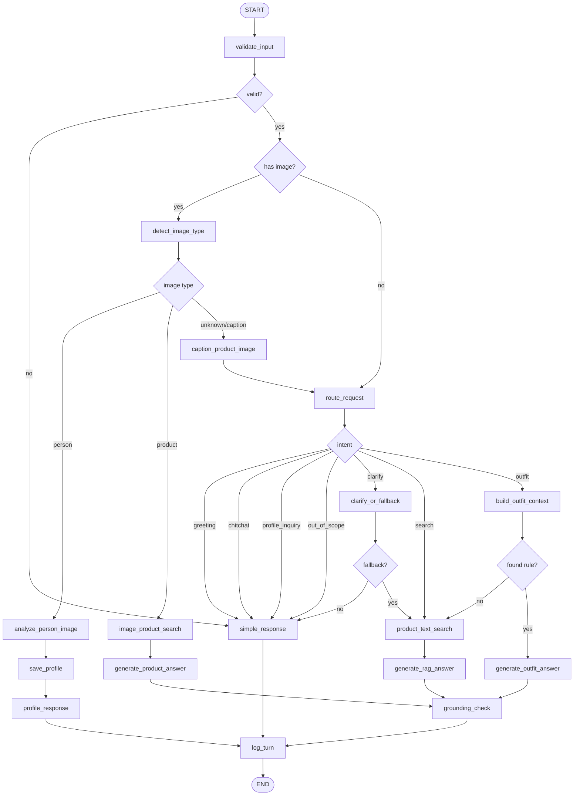

# De xuat so do LangGraph cho Fashion RAG Chatbot

> **Đề xuất tương lai, chưa phải runtime hiện tại:** Web app production hiện điều phối bằng `apps/api/api.py` và `src/fashion_rag/core/intent.py`, chưa chạy LangGraph. Xem [`04_RUNTIME_REQUEST_FLOW.md`](../runtime/04_RUNTIME_REQUEST_FLOW.md) để mô tả đúng hệ thống đang demo.

Tai lieu nay mo ta cach co the dua LangGraph vao pipeline hien tai cua he thong Fashion RAG Chatbot. Muc tieu khong phai thay the Qdrant, embedding, Ollama hay cac chain dang co, ma la tach phan dieu phoi trong `apps/api/api.py` thanh mot state graph ro rang, de debug va mo rong hon.

---

## 1. Y tuong chinh

Hien tai endpoint `/api/chat` dang lam nhieu viec trong mot luong xu ly lon:

```text
Nhan request
 -> validate input
 -> xu ly anh neu co
 -> route intent
 -> cap nhat profile/session
 -> chon chain phu hop
 -> retrieve/generate
 -> stream token
 -> grounding check
 -> ghi log
 -> tra ket qua
```

Khi dung LangGraph, cac buoc nay co the duoc tach thanh cac node doc lap. Moi node nhan `ChatState`, cap nhat mot phan state, roi graph quyet dinh node tiep theo bang conditional edge.

---

## 2. So do tong quan



---

## 3. State de xuat

```python
from typing import Any, Literal, TypedDict


class ChatState(TypedDict, total=False):
    # Input request
    session_id: str
    message: str
    image_path: str | None
    has_image: bool

    # Session/profile
    profile: dict[str, Any]
    last_bot_msg: str
    last_route_decision: Any
    unclear_count: int

    # Validation and routing
    is_valid: bool
    validation_message: str
    final_query: str
    active_query: str
    intent: Literal[
        "search",
        "image_search",
        "outfit",
        "greeting",
        "chitchat",
        "profile_inquiry",
        "out_of_scope",
        "clarify",
    ]
    route: str
    action: str
    route_source: str
    gender: str

    # Image pipeline
    image_type: Literal["person", "product", "unknown"]
    person_info: dict[str, Any]
    image_search_docs: list[Any]
    product_caption: str

    # Retrieval/generation
    retrieved_docs: list[Any]
    outfit_context: str
    product_images: list[dict[str, Any]]
    allowed_product_ids: set[str]
    answer_text: str

    # Runtime/evaluation
    start_time: float
    first_token_time: float | None
    total_time: float
    grounding_report: dict[str, Any]
    error: str | None
```

---

## 4. Mapping node voi code hien tai

| LangGraph node | Vai tro | Code hien tai co the tai su dung |
|---|---|---|
| `validate_input` | Kiem tra do dai, prompt injection, query rong | `fashion_rag.core.security.validate_user_query` |
| `detect_image_type` | Phan loai anh nguoi/san pham | `fashion_rag.infrastructure.llms.vision.detect_image_type` |
| `analyze_person_image` | Trich xuat dang nguoi, tone da | `fashion_rag.infrastructure.llms.vision.analyze_person_image` |
| `caption_product_image` | Caption anh khi image search truc tiep khong co ket qua | `fashion_rag.infrastructure.llms.vision.caption_product_image` |
| `image_product_search` | Tim san pham bang anh | `fashion_rag.modules.retrieval.image_search.search_products_by_image` |
| `route_request` | Chon route/intent/action/rewrite query | `fashion_rag.core.intent.route_user_request` |
| `clarify_or_fallback` | Neu mo ho nhieu lan thi fallback sang search | logic hien trong `apps/api/api.py` |
| `product_text_search` | Chuan bi RAG text search | `fashion_rag.application.chat.chains.get_fast_search_chain` |
| `build_outfit_context` | Tim Layer B rule va san pham Layer A | `fashion_rag.application.recommendation.outfit.build_outfit_context` |
| `generate_rag_answer` | Sinh cau tra loi dua tren retrieved docs | `get_fast_search_chain().stream(...)` |
| `generate_product_answer` | Sinh cau tra loi cho docs tu image search | `fashion_rag.application.chat.chains.get_product_answer_chain` |
| `generate_outfit_answer` | Sinh tu van outfit dua tren outfit context | `fashion_rag.application.chat.chains.get_outfit_chain` |
| `grounding_check` | Kiem tra ma san pham bi bia | `fashion_rag.core.security.check_answer_grounding` |
| `log_turn` | Ghi log chat/eval-lite | `fashion_rag.core.security.append_chat_turn_log` |

---

## 5. Ban graph rut gon dang code

Day la skeleton minh hoa, chua phai code drop-in. Y tuong la giu lai cac ham hien co, chi boc chung thanh node.

```python
from langgraph.graph import END, START, StateGraph


def build_chat_graph():
    graph = StateGraph(ChatState)

    graph.add_node("validate_input", validate_input_node)
    graph.add_node("detect_image_type", detect_image_type_node)
    graph.add_node("analyze_person_image", analyze_person_image_node)
    graph.add_node("caption_product_image", caption_product_image_node)
    graph.add_node("image_product_search", image_product_search_node)
    graph.add_node("route_request", route_request_node)
    graph.add_node("clarify_or_fallback", clarify_or_fallback_node)
    graph.add_node("simple_response", simple_response_node)
    graph.add_node("profile_response", profile_response_node)
    graph.add_node("product_text_search", product_text_search_node)
    graph.add_node("build_outfit_context", build_outfit_context_node)
    graph.add_node("generate_rag_answer", generate_rag_answer_node)
    graph.add_node("generate_product_answer", generate_product_answer_node)
    graph.add_node("generate_outfit_answer", generate_outfit_answer_node)
    graph.add_node("grounding_check", grounding_check_node)
    graph.add_node("log_turn", log_turn_node)

    graph.add_edge(START, "validate_input")

    graph.add_conditional_edges(
        "validate_input",
        route_after_validation,
        {
            "invalid": "simple_response",
            "image": "detect_image_type",
            "text": "route_request",
        },
    )

    graph.add_conditional_edges(
        "detect_image_type",
        route_after_image_type,
        {
            "person": "analyze_person_image",
            "product": "image_product_search",
            "caption": "caption_product_image",
        },
    )

    graph.add_edge("analyze_person_image", "profile_response")
    graph.add_edge("caption_product_image", "route_request")
    graph.add_edge("image_product_search", "generate_product_answer")

    graph.add_conditional_edges(
        "route_request",
        route_after_intent,
        {
            "simple": "simple_response",
            "clarify": "clarify_or_fallback",
            "search": "product_text_search",
            "outfit": "build_outfit_context",
        },
    )

    graph.add_conditional_edges(
        "clarify_or_fallback",
        route_after_clarify,
        {
            "clarify": "simple_response",
            "fallback_search": "product_text_search",
        },
    )

    graph.add_edge("product_text_search", "generate_rag_answer")

    graph.add_conditional_edges(
        "build_outfit_context",
        route_after_outfit_context,
        {
            "found": "generate_outfit_answer",
            "fallback_search": "product_text_search",
        },
    )

    graph.add_edge("generate_product_answer", "grounding_check")
    graph.add_edge("generate_rag_answer", "grounding_check")
    graph.add_edge("generate_outfit_answer", "grounding_check")

    graph.add_edge("simple_response", "log_turn")
    graph.add_edge("profile_response", "log_turn")
    graph.add_edge("grounding_check", "log_turn")
    graph.add_edge("log_turn", END)

    return graph.compile()
```

---

## 6. Luong streaming SSE khi dung LangGraph

Hien tai API dang tu quan ly `queue.Queue`, worker thread va token stream. Khi chuyen sang LangGraph, co the giu SSE cua FastAPI, nhung event nen gan voi tung node:

```text
route_detected
image_type_detected
person_analyzed
product_images
retrieval_done
token
grounding_done
done
```

Trong endpoint `/api/chat`, thay vi chua toan bo logic, endpoint chi con:

```text
1. Tao initial ChatState tu request
2. Chay graph.astream_events(...) hoac graph.stream(...)
3. Convert graph events thanh SSE events
4. Tra StreamingResponse
```

---

## 7. Loi ich khi dua vao luan van

Neu trinh bay trong do an/luan van, LangGraph giup he thong co diem manh ve kien truc:

- Luong xu ly duoc mo hinh hoa thanh state graph, khong chi la mot endpoint FastAPI tuan tu.
- Moi node co nhiem vu ro rang, de danh gia rieng: routing accuracy, retrieval quality, grounding error, latency.
- De bo sung checkpoint/persistence cho hoi thoai dai hoac tac vu ton thoi gian.
- De gan human-in-the-loop cho cac diem rui ro, vi du khi grounding check that bai.
- De mo rong thanh multi-agent nhe: `ProductSearchAgent`, `OutfitStylistAgent`, `VisionAgent`, `SafetyAgent`.

---

## 8. Cach ap dung thuc te theo tung buoc

Nen ap dung theo lo trinh nho de tranh lam hong pipeline dang chay:

1. Tao `src/fashion_rag/core/graph_state.py` chua `ChatState`.
2. Tao `src/fashion_rag/core/graph_nodes.py` boc cac ham hien co thanh node.
3. Tao `src/fashion_rag/core/chat_graph.py` khai bao `StateGraph`.
4. Giu endpoint `/api/chat` cu de doi chieu.
5. Tao endpoint thu nghiem `/api/chat_graph`.
6. So sanh output, latency, grounding log giua pipeline cu va pipeline LangGraph.
7. Khi on dinh moi thay `/api/chat` bang graph.

---

## 9. Ket luan

LangGraph phu hop voi he thong nay vi pipeline da co nhieu nhanh va nhieu trang thai:

```text
Text RAG
Image search
Person analysis
Outfit advice Layer B -> Layer A
Router
Redis/session memory
Grounding guardrail
Logging/evaluation
```

Gia tri lon nhat la bien he thong thanh mot pipeline co cau truc, de quan sat va de mo rong. Chatbot se khong tu dong "thong minh hon" chi vi them LangGraph, nhung he thong se de kiem soat hon, nhat la khi can bao ve kien truc trong phan research/demo.
